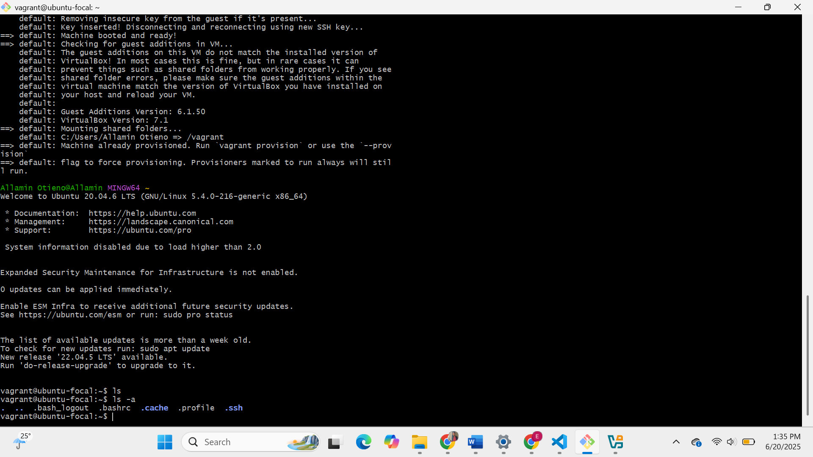
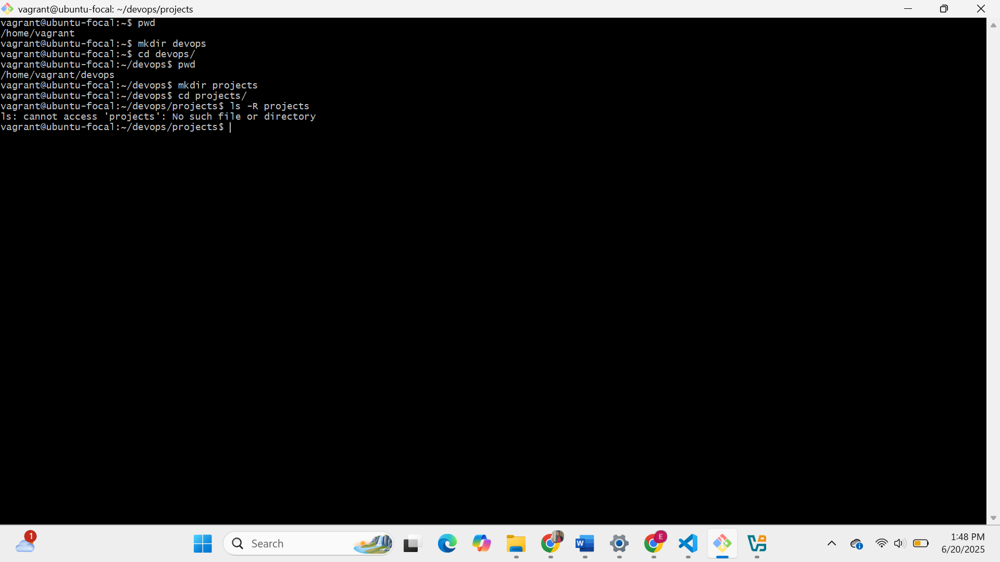
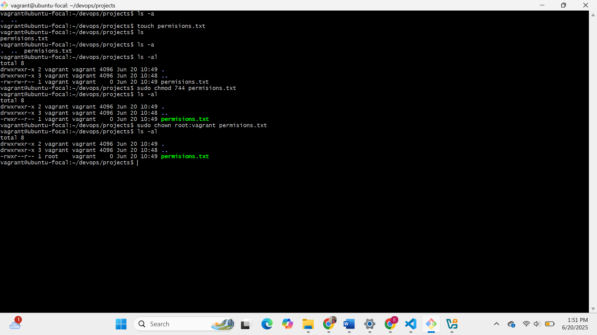
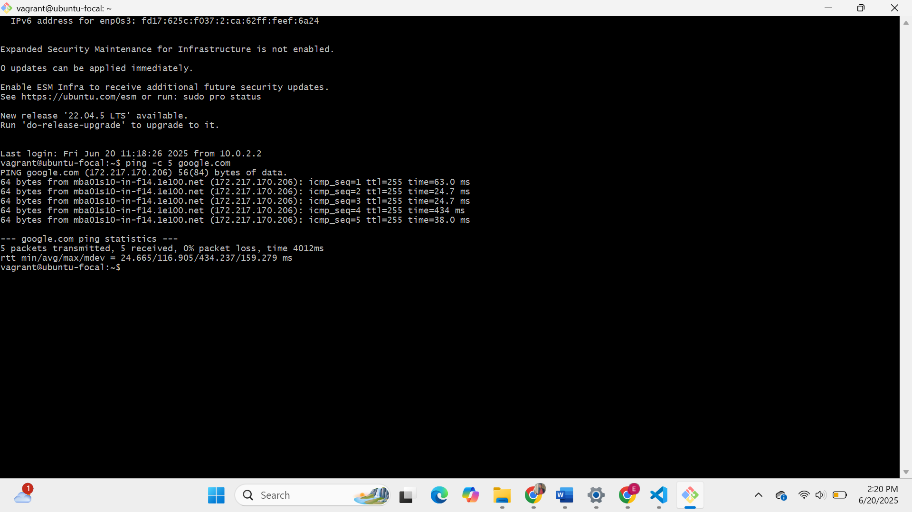

# Linux Fundamentals with Vagrant

This project demonstrates basic Linux system administration using a virtual machine managed by Vagrant.

---

## 1. Vagrant Initialization and SSH Login

**Description:**  
Initialized a Vagrant VM with Ubuntu and accessed it via SSH.

---

## 2. Linux File System Exploration

**Description:**  
Created a directory structure inside the VM: `/home/vagrant/devops/projects`.

---

## 3. Managing File Permissions and Ownership

**Description:**  
Created a file, changed its permissions to `744`, and changed ownership to `root:vagrant`. for user and group

---

## 4. Installing a Package

**Description:**  
Installed the `net-tools` package using `apt` 

[output](screenshots/4.png)

---

## 5. Testing Remote Connectivity

**Description:**  
Used `ping` to test connectivity to `google.com`.

